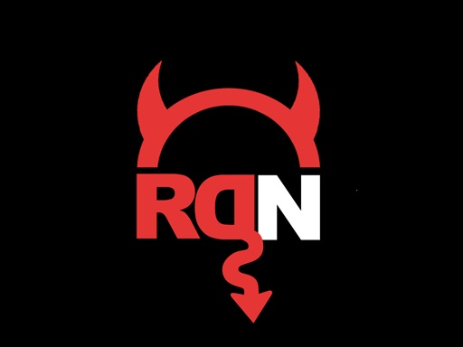
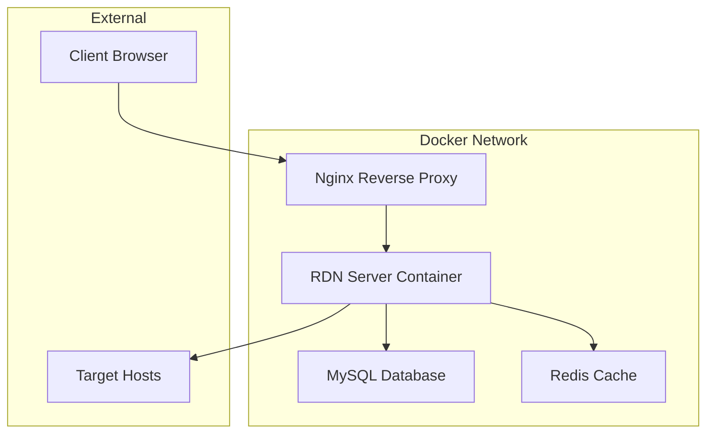

# RDN Framework v7.0 - Enhanced Command & Control Platform

<p align="center">
  
</p>

<p align="center">
  <strong>Modern, Secure, and Scalable Command & Control Framework</strong>
</p>

<p align="center">
  
  
  
  
</p>

## 🚀 What's New in v7.0

The RDN Framework has been completely modernized with enterprise-grade features, enhanced security, and a beautiful responsive interface. Originally designed 20 years ago, this version brings the framework into the modern era while maintaining its powerful core functionality.

### ✨ Major Enhancements

- **🎨 Modern Web Interface**: Complete UI overhaul with Bootstrap 5, responsive design, and dark theme
- **🔒 Enhanced Security**: Multi-factor authentication, rate limiting, session management, and audit logging
- **📊 Real-time Dashboard**: Live metrics, charts, and system monitoring with Chart.js
- **🐳 Docker Orchestration**: Multi-container setup with health checks and service dependencies
- **⚡ Performance Optimizations**: Redis caching, connection pooling, and optimized queries
- **🔧 Advanced Configuration**: Environment-based configs, feature flags, and centralized settings
- **📱 Mobile Responsive**: Works seamlessly on desktop, tablet, and mobile devices
- **🌐 WebSocket Support**: Real-time updates and live command execution
- **🛡️ Nginx Reverse Proxy**: SSL termination, rate limiting, and security headers

## 🏗️ Architecture Overview



### 🔧 Technology Stack

- **Frontend**: HTML5, CSS3, JavaScript ES6+, Bootstrap 5, Chart.js
- **Backend**: Perl CGI (Legacy), Enhanced with modern practices
- **Database**: MySQL 8.0 with optimized schema
- **Cache**: Redis 7 for session management and performance
- **Proxy**: Nginx with SSL/TLS and security headers
- **Containerization**: Docker Compose with health checks
- **Security**: Rate limiting, CSRF protection, audit logging

## 📋 Prerequisites

- Docker Engine 20.10+
- Docker Compose 2.0+
- 4GB RAM minimum (8GB recommended)
- 10GB disk space

## 🚀 Quick Start

### 1. Clone and Setup

```bash
git clone <repository-url>
cd RDN-FRAMEWORK
```

### 2. Configuration

#### For Local Development:
```bash
# The default configuration works out of the box
# Default credentials: admin / changeme123!
```

#### For GitHub Codespaces:
```bash
# Edit the configuration file
nano rdn_server/cgi-bin/rdn_server/config.conf

# Replace <codespace> with your actual codespace name
# Example: "orange-space-journey-5xj79qgjrvp2vwx6"
$rdn_hostname = "your-codespace-name-8080.app.github.dev";
$rdn_server = "https://" . $rdn_hostname;
```

#### For Production:
```bash
# Update configuration for your domain
$rdn_hostname = "your-domain.com";
$rdn_server = "https://" . $rdn_hostname;

# Generate SSL certificates
mkdir -p nginx/ssl
openssl req -x509 -nodes -days 365 -newkey rsa:2048 \
  -keyout nginx/ssl/rdn.key \
  -out nginx/ssl/rdn.crt
```

### 3. Launch the Framework

```bash
# Start all services
docker-compose up -d

# Check service status
docker-compose ps

# View logs
docker-compose logs -f
```

### 4. Access the Interface

- **Local**: http://localhost:8080
- **Codespace**: https://your-codespace-name-8080.app.github.dev
- **Production**: https://your-domain.com

**Default Login:**
- Username: `admin`
- Password: `changeme123!`

> ⚠️ **Security Note**: Change the default password immediately after first login!

## 🎯 Features

### 🖥️ Dashboard
- Real-time system metrics and statistics
- Interactive charts showing command activity
- Host status overview with visual indicators
- Recent activity feed with detailed logging

### 🖧 Host Management
- Add, edit, and delete managed hosts
- Support for multiple connection types (Web, SSH, RDP, API)
- Health monitoring with automatic status updates
- Bulk operations and host grouping

### 💻 Web Console
- Interactive terminal interface
- Command history and auto-completion
- Real-time command execution
- Multi-host session management

### 🔍 Audit & Logging
- Comprehensive audit trail
- Security event monitoring
- Command execution logging
- User activity tracking

### ⚙️ System Settings
- Centralized configuration management
- Feature flags and toggles
- Security policy configuration
- Backup and restore functionality

## 🔒 Security Features

### Authentication & Authorization
- Multi-factor authentication (2FA) support
- Role-based access control (RBAC)
- Session management with Redis
- Account lockout protection

### Network Security
- Rate limiting on all endpoints
- CSRF protection
- XSS prevention
- SQL injection protection
- Secure headers (HSTS, CSP, etc.)

### Audit & Monitoring
- Comprehensive audit logging
- Real-time security alerts
- Failed login attempt tracking
- Command execution monitoring

### Data Protection
- Encrypted password storage
- Secure session handling
- Database connection encryption
- Sensitive data masking

## 📊 Database Schema

The enhanced database schema includes:

- **Users**: Enhanced user management with 2FA support
- **Hosts**: Improved host tracking with metadata
- **Commands**: Detailed command execution history
- **Sessions**: Secure session management
- **Audit**: Comprehensive audit logging
- **Notifications**: Alert and notification system
- **System Config**: Centralized configuration storage

## 🔧 Configuration

### Environment Variables

```bash
# Application Environment
RDN_ENV=production
RDN_LOG_LEVEL=info

# Database Configuration
MYSQL_ROOT_PASSWORD=changeme
MYSQL_USER=rdn_user
MYSQL_PASSWORD=rdn_secure_pass
MYSQL_DATABASE=rdn

# Security Settings
RDN_SESSION_TIMEOUT=3600
RDN_MAX_LOGIN_ATTEMPTS=5
RDN_ENABLE_2FA=false
```

### Feature Flags

```perl
# Enable/disable features in config.conf
$rdn_enable_web_console = 1;
$rdn_enable_file_manager = 1;
$rdn_enable_system_monitor = 1;
$rdn_enable_network_scanner = 0;  # Disabled by default
$rdn_enable_backup_system = 1;
```

## 🚀 Advanced Usage

### Adding Hosts

1. Navigate to the **Hosts** section
2. Click **Add Host**
3. Fill in the host details:
   - **Name**: Unique identifier
   - **Type**: Connection method (Web/SSH/RDP/API)
   - **OS**: Operating system
   - **FQDN**: Fully qualified domain name
   - **Connection String**: Endpoint URL or connection details

### Command Execution

1. Go to the **Console** section
2. Select a target host
3. Enter commands in the terminal
4. Use arrow keys for command history
5. Tab for auto-completion

### API Integration

The framework provides RESTful APIs for integration:

```bash
# Get host list
curl -X GET http://localhost:8080/server/api/hosts \
  -H "Authorization: Bearer YOUR_API_KEY"

# Execute command
curl -X POST http://localhost:8080/server/api/console/execute \
  -H "Content-Type: application/json" \
  -d '{"host_id": 1, "command": "whoami"}'
```

## 🔧 Maintenance

### Backup

```bash
# Database backup
docker exec rdn-data mysqldump -u root -pchangeme rdn > backup.sql

# Full system backup
docker-compose down
tar -czf rdn-backup-$(date +%Y%m%d).tar.gz .
```

### Updates

```bash
# Pull latest images
docker-compose pull

# Restart services
docker-compose down
docker-compose up -d
```

### Monitoring

```bash
# Check service health
docker-compose ps
docker-compose logs

# Monitor resource usage
docker stats

# Database status
docker exec rdn-data mysql -u root -pchangeme -e "SHOW PROCESSLIST;"
```

## 🐛 Troubleshooting

### Common Issues

**Service won't start:**
```bash
# Check logs
docker-compose logs rdn-server

# Verify configuration
docker exec rdn-server cat /var/www/cgi-bin/rdn_server/config.conf
```

**Database connection issues:**
```bash
# Test database connectivity
docker exec rdn-server mysql -h rdn-data -u root -pchangeme -e "SELECT 1;"
```

**Permission errors:**
```bash
# Fix file permissions
docker exec rdn-server chown -R www-data:www-data /var/www/
```

### Performance Tuning

**Database optimization:**
```sql
-- Optimize tables
OPTIMIZE TABLE _audit, _hosts, _commands;

-- Check slow queries
SELECT * FROM mysql.slow_log ORDER BY start_time DESC LIMIT 10;
```

**Redis monitoring:**
```bash
# Monitor Redis performance
docker exec rdn-redis redis-cli INFO stats
docker exec rdn-redis redis-cli SLOWLOG GET 10
```

## 🤝 Contributing

1. Fork the repository
2. Create a feature branch
3. Make your changes
4. Add tests if applicable
5. Submit a pull request

## 📄 License

This project is licensed under the MIT License - see the [LICENSE](LICENSE) file for details.

## 🙏 Acknowledgments

- Original RDN Framework design and architecture
- Bootstrap team for the excellent CSS framework
- Chart.js for beautiful data visualization
- Docker community for containerization best practices

## 📞 Support

For support and questions:
- Create an issue in the repository
- Check the troubleshooting section
- Review the configuration documentation

---

<p align="center">
  <strong>RDN Framework v7.0 - Bringing 20-year-old innovation into the modern era</strong>
</p>
